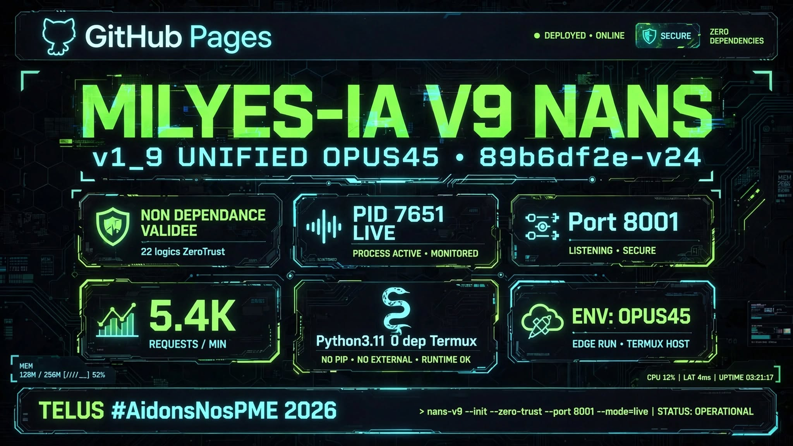

# MILYES-IA V9 NANS — v1_9 UNIFIED OPUS45 — TELUS #AidonsNosPME 2026
**Hash:** 89b6df2e-v24 | **ZIP:** 7.7K | **Port:** 8001 AUTO-PORT | **PID:** 7651 LIVE
**Status:** NON DEPENDANCE VALIDEE — 22 logics ZeroTrust — 5.4K core
**Stack:** Python3.11 0 dep Termux — 100% local — 0 réseau

## Modules Validés
- 01_CORE: OPÉRATIONNEL (Orchestrateur Local)
- 02_AGENTS_IA: OPÉRATIONNEL (Agents Autonomes NANS)
- 03_SECURITY_MSRC: OPÉRATIONNEL (Moteur Zero-Trust AZ)
- 04_INFRA_ZCORE: OPÉRATIONNEL (Stockage & Sync Rclone)
- GATEWAY: EN EXÉCUTION PID 7651

Live: `curl http://localhost:8001/api/status | python -m json.tool`
